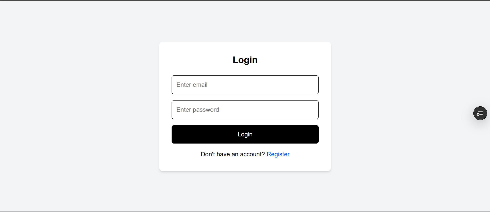
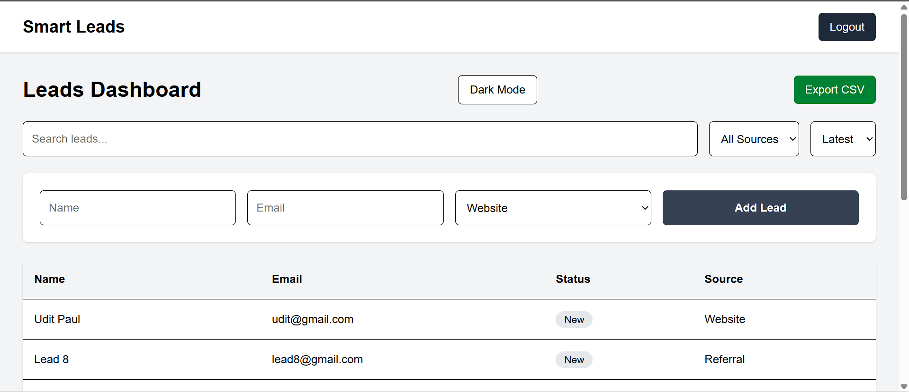
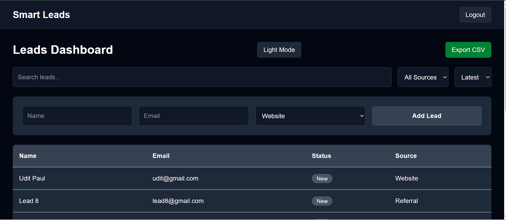

# Smart Leads Dashboard

## Live Demo

Frontend:
[View Live Application](https://smart-leads-dashboard-olive.vercel.app/)

Backend API:
[https://smart-leads-api-x4jq.onrender.com](https://smart-leads-api-x4jq.onrender.com)

A full-stack Lead Management Dashboard built using the MERN stack with TypeScript, JWT authentication, advanced filtering, pagination, CSV export, Docker support, and dark mode.

---

## Features

### Authentication
- User Registration
- User Login
- JWT Authentication
- Protected Routes
- Password Hashing using bcrypt

### Lead Management
- Create Lead
- View Leads
- Update Lead
- Delete Lead
- View Single Lead Details

### Advanced Features
- Search by Name or Email
- Filter by Source
- Filter by Status
- Sort by Latest/Oldest
- Backend Pagination
- CSV Export
- Dark Mode Support

### UI/UX
- Responsive Design
- Loading States
- Empty States
- Form Validation
- Reusable Components
- Clean Dashboard UI

### Dev Features
- Docker Setup
- TypeScript Frontend + Backend
- RESTful APIs
- MongoDB Integration
- Environment Variable Support

---

## Tech Stack

### Frontend
- React
- TypeScript
- TailwindCSS
- Axios
- React Router
- Vite

### Backend
- Node.js
- Express.js
- TypeScript
- MongoDB
- Mongoose
- JWT
- bcrypt

---

# Project Structure

```bash
smart-leads-dashboard/
│
├── client/
│   ├── public/
│   ├── src/
│   │   ├── api/
│   │   ├── components/
│   │   ├── pages/
│   │   ├── routes/
│   │   ├── assets/
│   │   ├── App.tsx
│   │   └── main.tsx
│   │
│   ├── Dockerfile
│   ├── package.json
│   └── vite.config.ts
│
├── server/
│   ├── src/
│   │   ├── controllers/
│   │   ├── middleware/
│   │   ├── models/
│   │   ├── routes/
│   │   ├── utils/
│   │   ├── validations/
│   │   ├── app.ts
│   │   └── server.ts
│   │
│   ├── Dockerfile
│   ├── package.json
│   └── tsconfig.json
│
├── docker-compose.yml
├── README.md
└── .gitignore
```

---

# Environment Variables

## Server (`server/.env`)

```env
PORT=5000
MONGO_URI=your_mongodb_connection_string
JWT_SECRET=your_jwt_secret
```

## Client (`client/.env`)

```env
VITE_API_URL=http://localhost:5000
```

---

# Setup Instructions

## 1. Clone Repository

```bash
git clone https://github.com/prerana1621/smart-leads-dashboard.git
```

---

## 2. Install Dependencies

### Frontend

```bash
cd client
npm install
```

### Backend

```bash
cd server
npm install
```

---

# Run Locally

## Backend

```bash
cd server
npm run dev
```

## Frontend

```bash
cd client
npm run dev
```

---

# Docker Setup

Run the complete application using Docker:

```bash
docker-compose up --build
```

---

# API Routes

## Authentication Routes

| Method | Route | Description |
|--------|-------|-------------|
| POST | `/api/auth/register` | Register User |
| POST | `/api/auth/login` | Login User |

---

## Lead Routes

| Method | Route | Description |
|--------|-------|-------------|
| GET | `/api/leads` | Get All Leads |
| GET | `/api/leads/:id` | Get Single Lead |
| POST | `/api/leads` | Create Lead |
| PUT | `/api/leads/:id` | Update Lead |
| DELETE | `/api/leads/:id` | Delete Lead |

---

# Screenshots

## Login Page



---

## Light Mode



---

## Dark Mode



---

# Assignment Requirements Covered

- TypeScript (Frontend + Backend)
- JWT Authentication
- CRUD Operations
- Filtering/Search/Sorting
- Backend Pagination
- CSV Export
- Docker Support
- Responsive UI
- Error Handling
- Form Validation
- Dark Mode

---

# GitHub Repository

https://github.com/prerana1621

---

# Author

**Prerana Acharyya**
